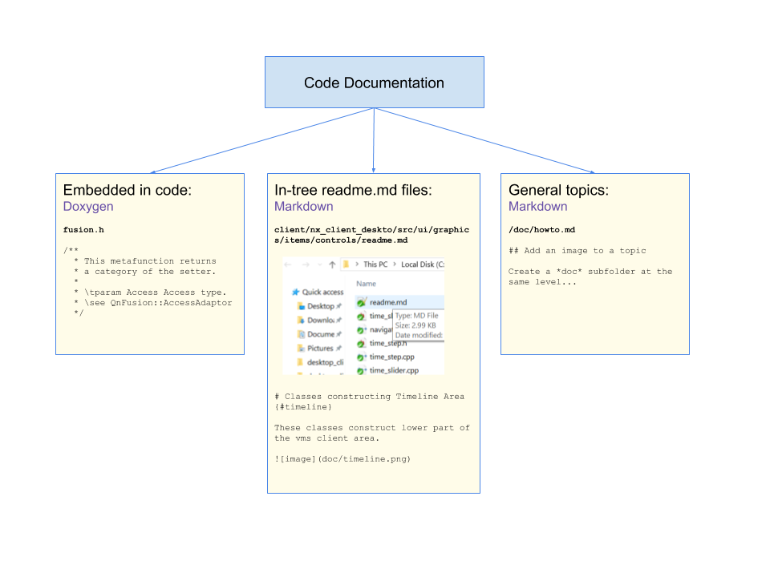

# Welcome to the VMS Code Doc {#mainpage}

VMS Documentation is generated with DoxyGen software http://www.doxygen.nl/index.html .

@subpage howto "How to write a new topic"

@subpage markdown "Markdown Dialect"

## Purpose

Currently most of VMS code comes undocumented. It makes very difficult for a new developer to dive into the code base and start working efficiently.
Most lacking is the high-level and middle-level documentation, shedding light on basic responsibility and interaction between VMS modules and classes.
As code base grows rapidly and other developers are being involved, the problem becomes more and more significant.

It is suggested to pay more attention on documenting VMS code, especially on the higher levels.

## Documentation sources

Documentation is generated from documentation embedded in source files as well as stand-alone topics.

### Embedded in code documentation

Embedded docs are contained inside source code should follow javadoc style - see our Code Style Guide - https://networkoptix.atlassian.net/wiki/spaces/SD/pages/44531791/+Coding+Style#id-%D0%A1++CodingStyle-Doxygen .
DoxyGen does a great job finding most of language entities, extracting relevant comments and making interlinked HTML documentation.
Embedded documentation is focused mostly on the low-level code information.

### In-tree readme.md

Middle-level documentation resides in *readme.md* files inside code tree. Those files are in Markdown format. Markdown is a lightweight extension to the plain text files, and Doxygen supports it directly
http://doxygen.nl/manual/markdown.html . Markdown files are also natively supported in Upsource viewer - 
https://www.jetbrains.com/help/upsource/markdown-syntax.html . It is strongly recommended to use only Markdown features supported by both Doxygen and Upsource.

An example of such readme can be found in folder /vms/client/nx_vms_client_desktop/src/ui/graphics/items/controls/ . It is allowed to have more than one doc file in a direcory if needed, so that the main one should be named *readme.md* and others should have also .md extension.

Images should be located in a *doc* subfolder created at the same level as *readme.md* file itself.

### General topics

High-level and special topics that do not correspond to a certain folder are located on the /doc project folder. They are also Markdown files. Images for those files are located in /doc/images folder.

## Generating Docs

To generate VMS documentation, enter /doc directory and execute *generate.cmd* for Windows or *generate.sh* for macOS or Linux.

## Covered modules

Currently only __client__ modules is included into documentation generation. To add other modules, add them to the following string in /doc/Doxyfile : 

INPUT                  = ../doc/ ../client/

Some modules are explicitly excluded:

EXCLUDE_PATTERNS       = *moc_*.cpp *ui_*.h  */nx_cloud_deploy/* */speex/*

