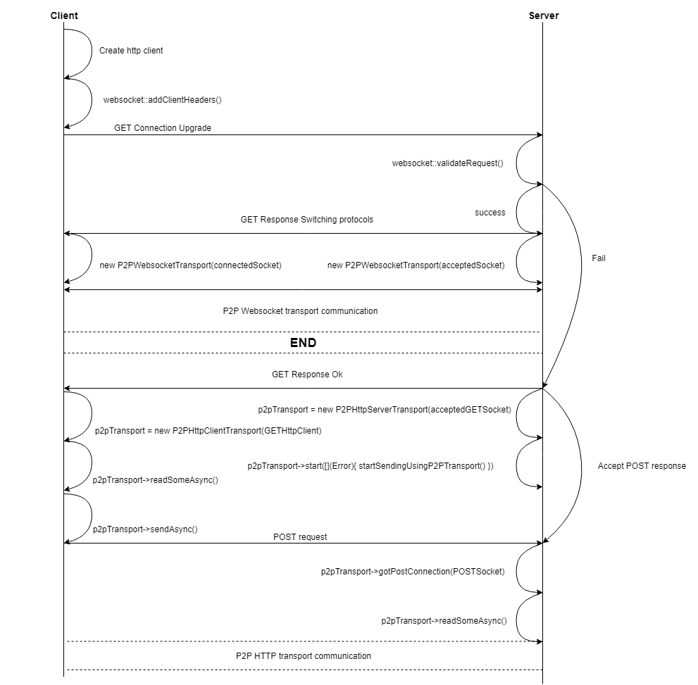

# P2P Socket
These classes represent a transport layer for Nx peer-to-peer communication. It uses a websocket
connection (a preferred way of doing things) or two separate http connections (in case if the
websocket connection fails for some reasons) internally.

# Usage sequence
</img>

# Examples
* Client side creation - `p2p_connection_base.cpp`
* Server side creation - `p2p_conneciton_listener.cpp`
* Both - `p2p_connection_testing_utility/src/main.cpp`