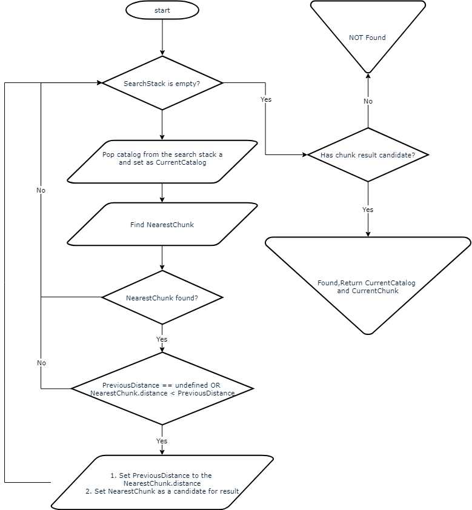

# Server archive
`QnServerArchiveDelegate` class is responsible for supplying media data for the given resource
(camera). It encapsulates sophisticated logic of selecting appropriate storage and quality to
provide as smooth playback experience as possible.
The core of the chunk selection logic is the `QnDualQualityHelper` class.

## Next chunk selection logic
#### Input data
|Param|value|comment|
|-----|-----|-------|
|time|integer|Time point we want to find next chunk close to|
|findMethod|\{Next, Previous\}|Seek direction|
|precise|bool|Determines if seek should be performed as precisely as possible|
|baseQuality|\{Low, High\}|Quality to adhere to|
|ignoredChunks|List<Chunk>|List of 'bad' chunks, the ones which we tried to play on the previous attempts and failed|
|SearchCatalogs|List<ChunkCatalog>|Stack of for search catalogs (MainStoragePool_PreferredQuality, MainStoragePool_AlternatinveQuality, BackupStoragePool_PreferredQuality, BackupStoragePool_AlternativeQuality)|
|PreviousDistance|integer|Time distance to the chunk found in the previous catalog. At the beginning set to the maximum possible value|

#### Algorithm
##### Main flow
</img>

##### Find chunk & distance
Generally we don't want to switch catalogs (hi to low or vice versa) too often when selecting next
chunk even if a chunk from the alternative catalog is closer than a one from the 'ours'. When
`precise` is `true` we are obliged to do so, but when it is `false` we consider a special constant,
`FindEpsilon`, to decide whether we will take the closest chunk from the alternative catalog or a
slightly farther located 'our' catalog chunk.
`FindEpsilon` is equal to `10` seconds when the current catalog is a low-quality catalog and `15`
seconds when it's high-quality.

</img>

If `Delta` < `FindEpsilon` then we won't switch to the alternative quality, otherwise we will.
