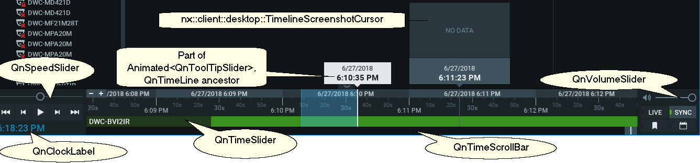
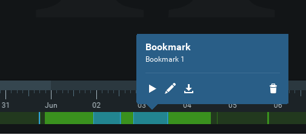

# Classes constructing Timeline Area {#timeline}

These classes construct lower part on the vms client area.



### Todo
Most of classes here are ancient and need refactoring code style upgrade. It is also suggested to move them (except *html_text_item* and probably *control_background_widget*) to some more specific source tree position.

## QnNavigationItem 
Main class managing all the bottom area. Central widget with the timeline is managed by **QnTimeSlider**. 

## QnTimeSlider 
Main class that manages the central part of the navigation widget. It is derived from 
**QnToolTipSlider** only to show white moving tooltip above the timeline. 
### Todo
This is one of the biggest vms units, 3500+ lines of code. It should be refactored.

## QnTimeStep 
Represents time labels on the timeline. 
**toShortString()** is used for time label below ticks (both smaller and bigger), and 
**toLongString()** is used for upper time labels in rectangles.

## QnSpeedSlider
Shows speed slider on the left.

## QnVolumeSlider
Shows volume slider on the left.

## QnTimeSliderPixmapCache
Caches text-containing bitmaps for the Timeline. There are two caches - one is for 
for datetimes below tickmarks, accessible via **tickmarkTextPixmap()**, and another one, accessible via **dateTextPixmap()** for dates above the tickmarks. 
### Internals
There are two internal caches, **m_pixmapByShortPositionKey** (256Mb) is for tickmarks and **m_pixmapByLongPositionKey** (64Mb) for dates above the tickmarks.

**m_pixmapByShortPositionKey** is multi-leveled (4 levels) for ticks of different order and indexed by 32-bit integers generated by **shortCacheKey()** from *time_step* module using timestamp, height and some additional info from **QnTimeStep**. 

**m_pixmapByLongPositionKey** is indexed by pair of 64-bit integers (**QnTimeStepLongCacheKey**), that is provided by **longCacheKey* from *time_step*.
Internally both caches are filled using global QnTextPixmapCache instance.
### Todo
Some public members should be made private.

## QnTimeScrollBar 
Custom-drawn scrollbar, the lowest part of the timeline. Handle grip is custom-drawn and mouse clicks are specifically-handled. Also shows indicator for the current time position.
### Todo
Rename **ensurePixmap()**, move **paint()** to private.

## QnBookmarksViewer 


Shows one stack of bookmarks in defined position.
### Todo
Needs code style upgrade. 

## QnClockLabel
Simple class to show clock in the lower-left corner of the vms window.

## QnHtmlTextItem
General graphic widget to display rich HTML text with customizations.
### Todo
Needs code style upgrade. Should be moved - it is inconsistently placed.

## QnControlBackgroundWidget
General graphic base widget to display frame and gradient fill for main panels (resources and notifications)
### Todo
Needs code style upgrade. Should be moved - it is inconsistently placed.

## QnBookmarkTagsControl
A widget that is used by **QnBookmarksViewer** to show bookmark tags.
### Todo
Needs code style upgrade.
