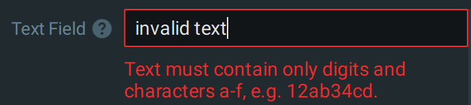

# Interactive Settings Engine

// Copyright 2018-present Network Optix, Inc. Licensed under MPL 2.0: www.mozilla.org/MPL/2.0/

In various places in the SDK, e.g. in Manifests of Analytics Plugin entities, there is a
possibility to define a Settings Model - a JSON describing a hierarchical structure of settings,
each having its name, type, and default value.

The Client can offer a user a dialog with controls corresponding to such Model. When the user fills
the dialog, a set of values is formed, represented as a map of strings, where the key is the id of
the particular setting in the Model, and the value is either a string itself (for settings of
the type String), or a JSON-formatted value (for settings of other types).

All editable controls have a value of some type, which can be represented as a string. For values
of type `String`, this string represents the value itself. For other types, this string is a JSON
value of the appropriate types.

Some field names have the same meaning through all the controls and can have some limitations.
- `"type"` - Type of the setting. Must be one of the values enumerated here.
- `"name"` - Unique id of the setting. Used when representing a Setting Value.
- `"defaultValue"` - Default value of the control. Will be sent to the engine on applying changes.

Certain fields are supported by some of the controls.

- `"isActive"` - Boolean. Marks the control as "active" - it means that every change of the control
    value in the GUI immediately (or with some delay in the case of TextField-like fields) triggers
    sending a request to the Server, without waiting for the confirmation with the "Apply" button.
    The request executes the code of the Active Setting handler of the entity being set up by these
    Settings. Note that if the Settings dialog is shown before the entity is created, no Active
    Setting requests will be fired before the user clicks "Apply" and the entity is created. The
    setting values sent in such a request are not meant to be "applied" (stored in a database) -
    they are intended only for preparing a proper reply to the user, which may include an adjusted
    Settings Model, adjusted values of the GUI controls, and a message to be shown to the user or a
    URL to be opened in the web browser. The main purpose of Active settings is to give the
    entities being set up a way to change the Settings Model and values on-the-fly, providing a
    better user experience. An example could be an Active combo-box which lists the supported
    measurement units, and the handler code which converts the entered value into the selected
    unit.

    ATTENTION: The "Active Setting" feature requires the reaction with the entity that the settings
    are intended for, like an Analytics Engine or a Device Agent. In certain scenarios, this entity
    may not exist yet - for example, when an Engine is going to be turned on for a camera for the
    first time, Device Agent settings are presented to the user (their Settings Model is defined in
    the Engine Manifest), but the Device Agent is created only after the user clicks `Apply`. In
    such case the `isActive` flag cannot work and is ignored, so for the optimal user experience it
    may be found useful to present the initial Settings Model that does not count on `isActive`,
    and after the settings are applied and the entity (e.g. Device Agent) is created, it may
    present a more advanced Settings Model which makes use of `isActive`.

- `"parametersModel"` - Settings Model JSON object. Applies only for controls with the `"isActive"`
    property set to `true`. Additional parameters are requested when the active control is
    triggered. NOTE: The `"parametersModel"` model does not support items with the `"isActive"`
    property set to `true`. The title, header, description and icon of the parameters dialog can be
    modified using additional fields in the settings model: `"title"`, `"header"`, `"description"`,
    `"icon"`. The `"icon"` field accepts the following values: `"information"` (default),
    `"question"`, `"warning"`, `"critical"`.

The Settings Model itself is a JSON object, which field `"items"` is a JSON array containing
top-level Setting Models for individual Settings, and those Settings that support inner Settings
(like `GroupBox`) may have them.

    {
        "type": "Settings",
        "items": [
            ...
        ]
    }

Here are the descriptions of all available Setting types, with examples of their definition in the
Settings Model, and examples of their value strings.

### Regular expressions
Some types of controls supports Regular Expressions (Regex).
General pattern syntax is described here:\
<https://developer.mozilla.org/en-US/docs/Web/JavaScript/Guide/Regular_Expressions>\
Note that only these flags are supported: `g`, `i`, `m`, `u`, `y`.\
Full information available in the
["ECMA-262 7th Edition" specification](https://262.ecma-international.org/7.0/).

---------------------------------------------------------------------------------------------------
## TextField

Text data field. Supports regex validation for the entered value.

[proprietary]

[/proprietary]

### Setting Model

    {
        "type": "TextField",
        "name": "textField1",
        "caption": "Text Field",
        "description": "A text field",
        "defaultValue": "a text",
        "validationErrorMessage": "Text must contain only digits and characters a-f, e.g. 12ab34cd.",
        "validationRegex": "^[a-f0-9]+$",
        "validationRegexFlags": "i",
        "isActive": false
    }

### Setting Value

    "textField1": "some text"

---------------------------------------------------------------------------------------------------
## PasswordField

Password data field. Supports regex validation for the entered value.

[proprietary]

[/proprietary]

### Setting Model

    {
        "type": "PasswordField",
        "name": "passwordField1",
        "caption": "Password Field",
        "description": "A password field",
        "defaultValue": "1234",
        "validationErrorMessage": "Password must contain only digits",
        "validationRegex": "^[0-9]+$",
        "validationRegexFlags": "i",
        "isActive": false
    }

### Setting Value

    "passwordField1": "password"

---------------------------------------------------------------------------------------------------
## SpinBox

Integer number data field. Supports minimum and maximum value limitations.

[proprietary]

[/proprietary]

### Setting Model

    {
        "type": "SpinBox",
        "name": "integerField1",
        "caption": "Number Field",
        "description": "An integer number field",
        "defaultValue": 5,
        "minValue": 0,
        "maxValue": 100,
        "isActive": false
    }

### Setting Value

    "integerField1": 10

---------------------------------------------------------------------------------------------------
## DoubleSpinBox

Floating point number data field. Supports minimum and maximum value limitations.

[proprietary]

[/proprietary]

### Setting Model

    {
        "type": "DoubleSpinBox",
        "name": "floatingField1",
        "caption": "Number Field",
        "description": "A floating-point number field",
        "defaultValue": 3.141,
        "minValue": 0.0,
        "maxValue": 100.0,
        "isActive": false
    }

### Setting Value

    "floatingField1": 5.500

---------------------------------------------------------------------------------------------------
## ComboBox

Text choice data field. Items in `itemCaptions` are optional, as well as `itemCaptions` itself.

[proprietary]

[/proprietary]

### Setting Model

    {
        "type": "ComboBox",
        "name": "combobox1",
        "caption": "Combo Box",
        "description": "Choose one",
        "defaultValue": "v2",
        "range": ["v1", "v2", "v3"],
        "isActive": true,
        "itemCaptions": {
            "v1": "value1",
            "v2": "value2",
            "v3": "value3"
        }
    }

### Setting Value

    "combobox1": "v2"

---------------------------------------------------------------------------------------------------
## RadioButtonGroup

Alternative text choice data field. Items in `itemCaptions` are optional, as well as `itemCaptions`
itself.

[proprietary]

[/proprietary]

### Setting Model

    {
        "type": "RadioButtonGroup",
        "name": "radiogroup1",
        "caption": "RadioButton Group",
        "description": "Choose one",
        "defaultValue": "opt2",
        "range": ["opt1", "opt2", "opt3", "opt4"],
        "isActive": true,
        "itemCaptions": {
            "opt1": "option1",
            "opt2": "option2",
            "opt3": "option3",
            "opt4": "option4"
        }
    }

### Setting Value

    "radiogroup1": "opt2"

---------------------------------------------------------------------------------------------------
## CheckBox

Boolean data field.

[proprietary]

[/proprietary]

### Setting Model

    {
        "type": "CheckBox",
        "name": "checkbox1",
        "caption": "Check Box",
        "description": "True or False",
        "defaultValue": true,
        "isActive": false
    }

### Setting Value

    "checkbox1": true

---------------------------------------------------------------------------------------------------
## CheckBoxGroup

One or several boolean options choice data field. Items in `itemCaptions` are optional, as well as
`itemCaptions` itself.

[proprietary]

[/proprietary]

### Setting Model

    {
        "type": "CheckBoxGroup",
        "name": "checkgroup1",
        "caption": "CheckBox Group",
        "description": "Choose one or several options",
        "defaultValue": ["opt2", "opt3"],
        "range": ["opt1", "opt2", "opt3", "opt4"],
        "isActive": false,
        "itemCaptions": {
            "opt1": "Option #1",
            "opt2": "Option #2",
            "opt3": "Option #3",
            "opt4": "Option #4"
        }
    }

### Setting Value

    "checkgroup1": ["opt2", "opt3"]

---------------------------------------------------------------------------------------------------
## SwitchButton

Boolean data field, alternative visual representation.

[proprietary]

[/proprietary]

### Setting Model

    {
        "type": "SwitchButton",
        "name": "switch1",
        "caption": "Switch Button",
        "description": "Tooltip for the switch button",
        "defaultValue": true,
        "isActive": true
    }

### Setting Value

    "switch1": true

---------------------------------------------------------------------------------------------------
## Link

A clickable hyperlink.

[proprietary]

[/proprietary]

### Setting Model

    {
        "type": "Link",
        "caption": "Customer Support",
        "url": "https://example.com/"
    }

---------------------------------------------------------------------------------------------------
## Banner

A static text with an icon.

The `"icon"` field is optional and accepts the following values: `"info"` (default), `"warning"`.

The `"text"` field supports hyperlinks, for example:
`"<a href=\"https://example.com/\">example</a>"`.

NOTE: This setting is non-editable and has no value, it is just a visual item in the dialog.

NOTE: There is a similar non-editable item with a different look, called `Placeholder`.

[proprietary]

[/proprietary]

### Setting Model

    {
        "type": "Banner",
        "icon": "info",
        "text": "Some text"
    }

---------------------------------------------------------------------------------------------------
## Placeholder

A static icon with a header and a description. If there are no other items, takes up all the space.

The `"header"` and `"description"` fields support hyperlinks, for example:
`"<a href=\"https://example.com/\">example</a>"`.

The `"icon"` field accepts the following values:
- `"default"` (default)
- `"email_sent"`
- `"events"`
- `"lan_search"`
- `"motion"`
- `"no_bookmarks"`
- `"no_devices"`
- `"no_groups"`
- `"no_objects"`
- `"no_settings"`
- `"not_found"`
- `"notification"`
- `"open_folder"`
- `"search_by_ip"`

NOTE: This setting is non-editable and has no value, it is just a visual item in the dialog.

NOTE: There is a similar non-editable item with a different look, called `Banner`.

[proprietary]

[/proprietary]

### Setting Model

    {
        "type": "Placeholder",
        "icon": "default",
        "header": "Header",
        "description": "Description"
    }

---------------------------------------------------------------------------------------------------
## PolygonFigure

Polygon figure field. Supports maximum points limitation.

[proprietary]

[/proprietary]

### Setting Model

    {
        "type": "PolygonFigure",
        "name": "polygon1",
        "caption": "Polygon",
        "description": "Some polygon",
        "minPoints": 4,
        "maxPoints": 8
    }

### Setting Value

    "polygon1": {
        "figure": {
            "color": "#ffab40",
            "points": [
                [0.138, 0.551],
                [0.775, 0.429],
                [0.748, 0.844]
            ]
        },
        "label": "User Polygon",
        "showOnCamera": true
    }

---------------------------------------------------------------------------------------------------
## BoxFigure

Box figure field.

[proprietary]

[/proprietary]

### Setting Model

    {
        "type": "BoxFigure",
        "name": "box1",
        "caption": "Box",
        "description": "Some box"
    }

### Setting Value

    "box1": {
        "figure": {
            "color": "#536dfe",
            "points": [
                [0.28, 0.177],
                [0.598, 0.684]
            ]
        },
        "label": "User Box",
        "showOnCamera": false
    }

---------------------------------------------------------------------------------------------------
## LineFigure

Line or polyline figure field. Supports minimum and maximum points limitation (default value: 2 for
both min and max). Can have single crossing direction or not have any (equivalent to having both
directions).

[proprietary]

[/proprietary]

### Setting Model

    {
        "type": "LineFigure",
        "name": "line1",
        "caption": "Line",
        "description": "Some line",
        "minPoints": 2,
        "maxPoints": 8,
        "allowedDirections": "one"
    }

`allowedDirections` restricts the set of allowed values for direction:
- `any` (default): `left | right | absent`
- `none`: `absent`
- `one`: `left | right`

### Setting Value

    "line1": {
        "figure": {
            "color": "#ffab40",
            "points":[
                [0.338, 0.500],
                [0.14, 0.346],
                [0.365, 0.805]
            ],
            "direction": "right"
        }
        "label": "User Line",
        "showOnCamera": true
    }

Direction options: `left | right | absent`

---------------------------------------------------------------------------------------------------
## ObjectSizeConstraints

Figure composed of two boxes, minimum and maximum. If the minimum box has width or height greater
than that of the maximum box, the figure is considered invalid.

Has neither label nor display on camera options. Therefore may have no color.

[proprietary]

[VMS-17379](https://networkoptix.atlassian.net/browse/VMS-17379)

[/proprietary]

### Setting Model

    {
        "type": "ObjectSizeConstraints",
        "name": "sizeConstraints1",
        "caption": "Person size constraints",
        "description": "Size range a person should fit into to be detected",
        "defaultValue": {
            "minimum": [0.1, 0.3],
            "maximum": [0.3, 0.9]
        }
    }

### Setting Value

    "sizeConstraints1": {
        "minimum": [0.1, 0.3],
        "maximum": [0.3, 0.9],
        "positions": [
            [0.2, 0.24],
            [0.12, 0.07]
        ]
    }

The `"positions"` field is a hint for the client where to position min/max boxes, and is optional.

---------------------------------------------------------------------------------------------------
## Button

An action button. Technically it is a setting which does not have a value, but can be marked with
`"isActive" = "true"`. As for any Active setting, it allows to request a set of parameters via
offering a dialog to the user, and implement any reaction in the Active Setting call-back code, as
well as display a message to the user or open a URL in the web browser.

[proprietary]

[/proprietary]

### Setting Model

    {
        "type": "Button",
        "name": "button1",
        "caption": "Button 1",
        "description": "Action 1",
        "isActive": true,
        "parametersModel": {
            "type": "Settings",
            "items":
            [
                {
                    "type": "TextField",
                    "name": "url",
                    "caption": "Url",
                    "defaultValue": "https://example.com/"
                }
            ]
        }
    }

---------------------------------------------------------------------------------------------------
## Structure

Structure components are used for the data visual representation only. They are not editable in any
matter, their state is not saved (even if can be modified). Most of them contain `items` array,
which can hold any other components.

Here are the descriptions of all available structure components.

---------------------------------------------------------------------------------------------------
## Settings

System root element. Must be present only once as the root, containing all other elements and all
sections.

[proprietary]

[/proprietary]

### Setting Model

    {
        "type": "Settings",
        "items": [
            {
                "type": "GroupBox",
                "caption": "Sample GroupBox",
                "items": [
                    { "type": "CheckBox", "name": "checkbox1", "caption": "Sample CheckBox" }
                ]
            }
        ],
        "sections": [
            { "type": "Section", "name": "Sample Section" }
        ]
    }

---------------------------------------------------------------------------------------------------
## Section

Grouping tree-like element. Can contain both items and sub-sections.

Property "name" must be unique, will be used as a caption if caption is not specified.

[proprietary]

[/proprietary]

### Setting Model

    {
        "type": "Section",
        "name": "root_section",
        "caption": "Example",
        "items": [  { "type": "CheckBox", "name": "checkbox1", "caption": "Sample CheckBox 1" } ]
        "sections": [
            { "type": "Section", "name": "Nested Section" }
        ]
    },
    {
        "type": "Section",
        "caption": "ROI"
    }

---------------------------------------------------------------------------------------------------
## GroupBox

Grouping panel with a caption. Top-level groupboxes visually distinguished from the nested if the
style is not specified or set to `"default"`.

The `"style"` field is optional and accepts the following values:
- `"default"` (top-level groupboxes will have style `"panel"` and nested will have style `"group"`)
- `"panel"`
- `"group"`
- `"label"`

[proprietary]

[/proprietary]

### Setting Model

    {
        "type": "GroupBox",
        "caption": "Top-level groupbox",
        "style": "default",
        "items": [
            { "type": "CheckBox", "caption": "CheckBox", "description": "Hint" },
            { "type": "SpinBox", "caption": "SpinBox",  "description": "Hint" },
            {
                "type": "GroupBox",
                "caption": "Nested groupbox",
                "items": [
                { "type": "CheckBox", "caption": "CheckBox" },
                { "type": "TextField", "caption": "TextField", "description": "Hint" },
                {
                    "type": "GroupBox",
                    "caption": "Nested groupbox of level 2",
                    "items": [
                        { "type": "CheckBox", "caption": "CheckBox", "description": "Hint" },
                        { "type": "TextField", "caption": "TextField" }
                    ]
                }
            ]
            }
        ]
    }

---------------------------------------------------------------------------------------------------
## Separator

Horizontal separator line.

[proprietary]

[/proprietary]

### Setting Model

    {
        "type": "Separator"
    }

---------------------------------------------------------------------------------------------------
## Repeater

Grouping element which generates N items from the given template and displaying them when needed.

[proprietary]

[VMS-17299](https://networkoptix.atlassian.net/browse/VMS-17299)

[/proprietary]

Repeater expands '#N' (or short form '#') string in its template to an item number. Nested
repeaters distinguish their numbering by N number in '#N'. To escape '#' sign, it must be doubled:
'##'.

When the Repeater is used with a generic grouping item (like `GroupBox`) and it should hide empty
items, then the grouping item should set the field `"filledCheckItems"`. This field should contain
a list of items which should be considered to decide whether the group is filled or empty.

### Setting Model

    {
        "type": "Repeater",
        "count": 10,
        "startIndex": 0,
        "template":
        {
            "type": "GroupBox",
            "caption": "Line #",
            "filledCheckItems": ["roi.figures.line#.figure"],
            "items":
            [
                {
                    "type": "LineFigure",
                    "name": "roi.figures.line#.figure"
                },
                {
                    "type": "SpinBox",
                    "name": "roi.figures.line#.sensitivity",
                    "caption": "Sensitivity"
                },
                {
                    "type": "Repeater",
                    "count": 5,
                    "startIndex": 1,
                    "template":
                    {
                        "type": "TextField",
                        "name": "roi.figures.line#1.comment#2",
                        "caption": "Comment ###"
                    }
                }
            ]
        }
    }

[proprietary]

---------------------------------------------------------------------------------------------------
## Row

**INTERNAL**

Re-ordering element to place items horizontally in a single row. Can lead to strange visual
effects, so keeping it for internal usage.

### Setting Model

    {
        "type": "Row",
        "items": [
            {
                "type": "Button",
                "name": "button1",
                "caption": "Button 1"
            },
            {
                "type": "Button",
                "name": "button2",
                "caption": "Button 2"
            }
        ]
    }

---------------------------------------------------------------------------------------------------
## Flow

Grouping element with a caption places items in a flow, ignoring their captions.

### Setting Model

    {
        "type": "Flow",
        "caption": "Buttons",
        "items": [
            {
                "type": "Button",
                "name": "button1",
                "caption": "Button 1"
            },
            {
                "type": "Button",
                "name": "button2",
                "caption": "Button 2"
            }
        ]
    }

---------------------------------------------------------------------------------------------------
## Column

Acts like `GroupBox` but does not have any frame.

## Settings Model

    {
        "type": "Column",
        "items": [
            {
                "type": "Button",
                "name": "button1",
                "caption": "Button 1"
            },
            {
                "type": "Button",
                "name": "button2",
                "caption": "Button 2"
            }
        ]
    }

[/proprietary]
