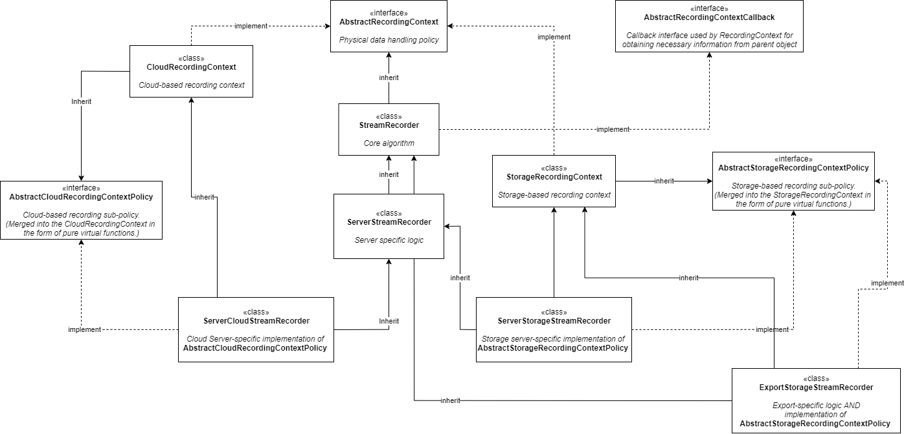

# StreamRecorder class hierarchy {#stream_recorder}

// Copyright 2018-present Network Optix, Inc. Licensed under MPL 2.0: www.mozilla.org/MPL/2.0/

### Introduction
StreamRecorder family of classes is at the core of Nx recording. They are used for camera
stream recording in server, video exporting in client and other pieces of functionality such as
recording of virtual camera uploaded files and timelapse exporting.

## Hierarchy

StreamRecorder class hierarchy employs the idea of policy mix-ins, which is implemented using
"delegate to a sister class" C++ technique. Core processing algorithm is in the base class, while
exact physical data handling policies are defined in the AbstractRecordingContext descendants.
Those descendants might also delegate part of its functionality to the sub-policies.

## Class diagram

