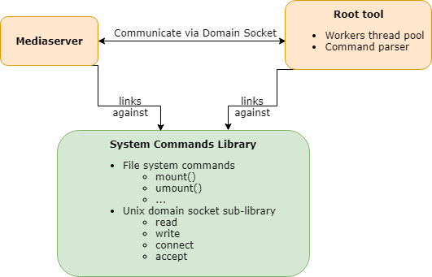
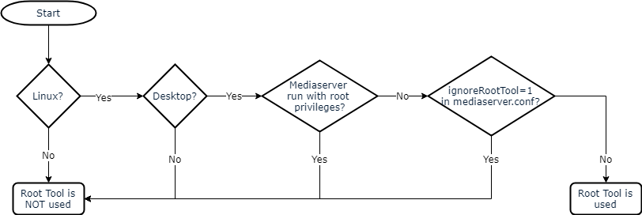
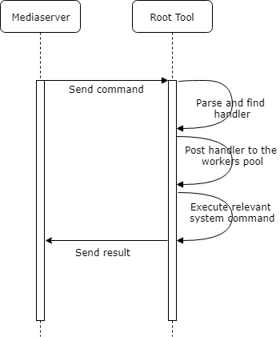

# Root Tool
Root tool is a supplementary standalone linux service run under control of the Service Manager
(systemd, upstart) which is used by Nx Witness Mediaserver to perform certain operations which
require superuser access, such as:

* Mounting/unmounting external cifs storages
* Acquiring hardware information for license-related operations
* Reading and writing database and media files on partitions already mounted by other OS users.

## Supported commands
|Command|Description|
|-------|-----------|
|`mount`|mount cifs file system|
|`umount`|unmount mounted cifs file system|
|`chown`|change ownership for certain path in the file system|
|`mkdir`|create directory with the given path|
|`rm`|remove given path|
|`mv`|move/rename file from one location to another|
|`open`|open file and return file descriptor|
|`freeSpace`|return the amount of free space for the device on which the given path is located|
|`totalSpace`|return the amount of total space for the device on which the given path is located|
|`exists`|return whether the given path exists|
|`list`|return serialized contents of the given directory|
|`dmiInfo`|return certain hardware information necessary for the hardware ID calculation|

## Components
</img>

## When Root Tool is used
</img>

When Root Tool is not used, Mediaserver uses `SystemCommands` library
(see [Components](#components)) directly.

## Workflow
</img>

## Protocol
Mediaserver and Root Tool communicate over Unix Domain Socket using following binary protocol

### Request
|Field|Size (bytes)|Description|
|-----|------------|-----------|
|`length`|4|length of the following command string|
|`command`|variable|command string|

### Responses
#### open
|Field|Size (bytes)|Description|
|-----|------------|-----------|
|`fd`|4|opened file descriptor|

#### list and dmiInfo
|Field|Size (bytes)|Description|
|-----|------------|-----------|
|`length`|4|length of the response data|
|`response`|variable|serialized response|

#### others
|Field|Size (bytes)|Description|
|-----|------------|-----------|
|`result`|8|result code for commands like `rm` and `mv` or actual value for commands like `freeSpace` or `totalSpace`|